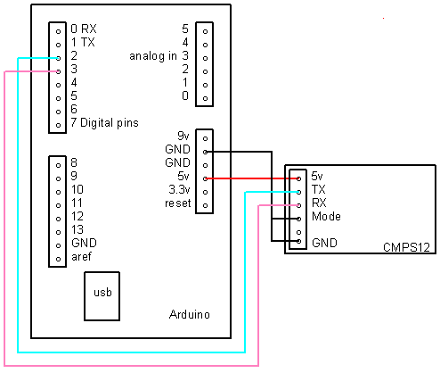

# ControlAntena

Radio Telescope System Setup

- Arduino to CMPS11 connection

- Debian
  - Anaconda + dedicated py3 env
  - apt gnuradio
  - apt gqrx-sdr
  - sudo uhd_images_downloader (slow)
  
  

